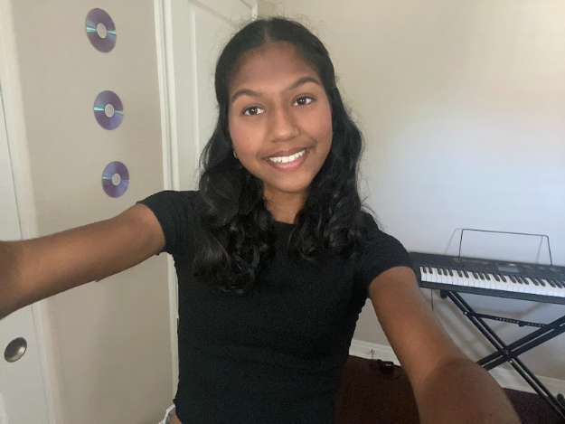
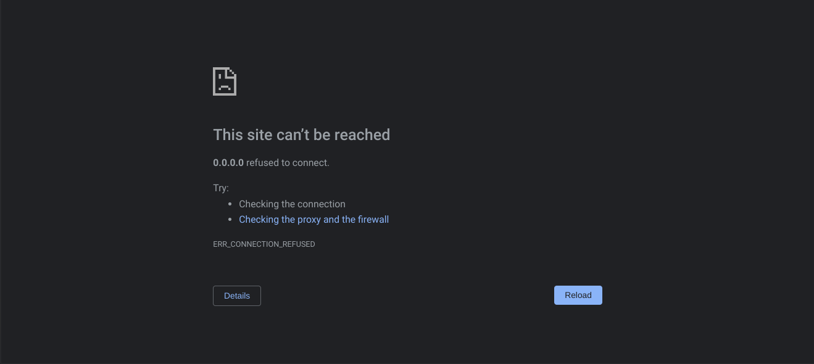

##  Samhita's Page  
Play this music for the best webpage viewing experience!

<iframe width="560" height="315" src="https://www.youtube.com/embed/5izgLqfqGbw?si=R5jGdTbFNqPg0gmy&amp;controls=0" title="YouTube video player" frameborder="0" allow="accelerometer; autoplay; clipboard-write; encrypted-media; gyroscope; picture-in-picture; web-share" allowfullscreen></iframe>

   Hi! My name is Samhita, and this is my blog for AP CSP! I am a sophomore excited to be in this class. I took this class because I love technology and problem-solving, and I aspire to have a future relating to Computer Science. My parents grew up in India, but I was born in Memphis, Tennessee, then I moved to the Bay Area seven years later, and just two years ago, I moved to San Diego. I am a dancer and do Bharatanatyam, an Indian classical dance style. I also love nature and try to soak in as much sunshine as I can, often reading on grassy hills and hiking. My love for the outdoors goes hand in hand with being a varsity cross country and long-distance track runner for Del Norte. Through creating my freeform image, I learned how to put my thoughts into drawings and symbols, so other people can understand them. This is similar to writing code in order for a computer to process the statements.

###   To add this image, I downloaded it onto my computer, and added it to github, which gave me a link that I could enter on vscode. Then, I noticed that it was compressed, so I added parameters to make it the size I wanted.

###   One problem I faced was opening my server on my chromebook. Originally, I got the server address and I opened it directly on another window on Google Chrome. After replacing 0.0.0.0 with localhost, and it still not responding, I realized that I was supposed to open it on my cloud workspace. With hindsight, it doesn't seem like a major issue, however, it set me back a day because I wasn't able to open my webpage.

##   A dog coding on a computer! 

<iframe allow="fullscreen" frameBorder="0" height="600" src="https://giphy.com/embed/tdLMeEDsWCow4Pb553/video" width="480"></iframe>

##   I'm also a huge Swiftie, so I here's a list of my favorite songs from my personal top 3 albums.

| Folklore | Speak Now (Taylor's Version) | Lover |
| -------- | -------- | -------- |
| cardigan | Dear John | Cruel Summer |
| the 1 | Better than Revenge | Paper Rings |
| invisible string | Sparks Fly | Lover |

###   Overview of Hacks, Study and Tangibles
  Blogging in GitHub pages is a way to learn and code at the same time. 

 
- Plans, Lists, [Scrum Boards](https://clickup.com/blog/scrum-board/) help you to track key events, show progress and record time.  Effort is a big part of your class grade.  Show plans and time spent!
 
- [Hacks(Todo)](https://levelup.gitconnected.com/six-ultimate-daily-hacks-for-every-programmer-60f5f10feae) enable you to stay in focus with key requirements of the class.  Each Hack will produce Tangibles.
 
- Tangibles or [Tangible Artifacts](https://en.wikipedia.org/wiki/Artifact_(software_development)) are things you accumulate as a learner and coder. 
